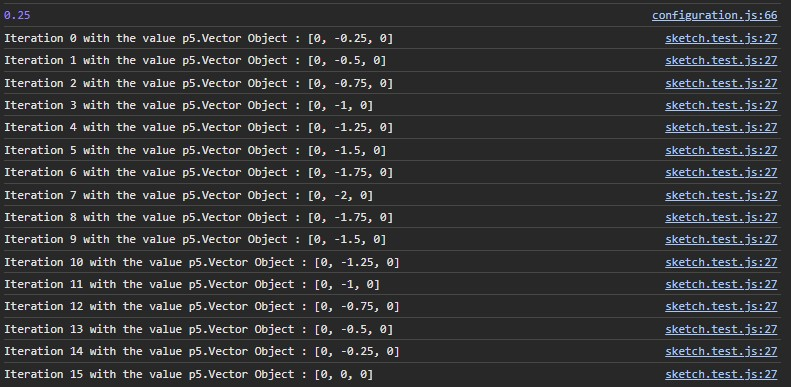

# GameProject

University's game project that goes with the Introduction to programming 1

## The bits I found difficult

Making it to the deadline, that was my biggest struggle. I have to admit that most of the things my project is missing would've been there if I started to code them earlier, even planning my goals at the start of the University is sometimes difficult to me, follow them and complete my assignments at good time with all the requirements, an example of this problem is the sliding world, that was left behing because of the hurry - I tried to complete the game project from almot zero within four days -

## The extensions

Most of my effort was at vectorial math, the experimentation with this data structure was very insighful for me, playing with the math involved combined with great tools like the generators allowed me to code a project with the physics as the main focus. Additionally mapping every key with its respective direction help to simplify the process of chaging the movement of the character/player and speaking of simple, dinamyc script hooks supported the modularization of the code into different files making it more maintainable and clean.

Using maps to simplify the process of coding the directions
Adding the p5 library at custom time
Using generators to simulate gravity and the continous agregation of force
Using modules to divide the code

## Learnt/Practiced skills

Being patient to solve all the problems that came, the modularization of the code through multiple files and managing the dependencies between them, logical reasoning to find a fitness solution for every challenge and problem and creativity (not exactly in the graphics)

### Todo

- Increase jump distance (done)
- Code collision with platforms (done)
  - Collision underneath (done)
  - Use the limits with the gravity (done)
- Code collission with coins (done)
- Code pitfalls (done)
- Code enemies (done)
- Code game logic
  - hearts or life count (done)
  - Invulnerable mechanic (done)
  - Game over screen (done)
  - Win screen (done)
- Solve all the bugs (not done)

- Add sound effects (done)
- Add scenery (not done)
- Slide world (not done)

## Results

